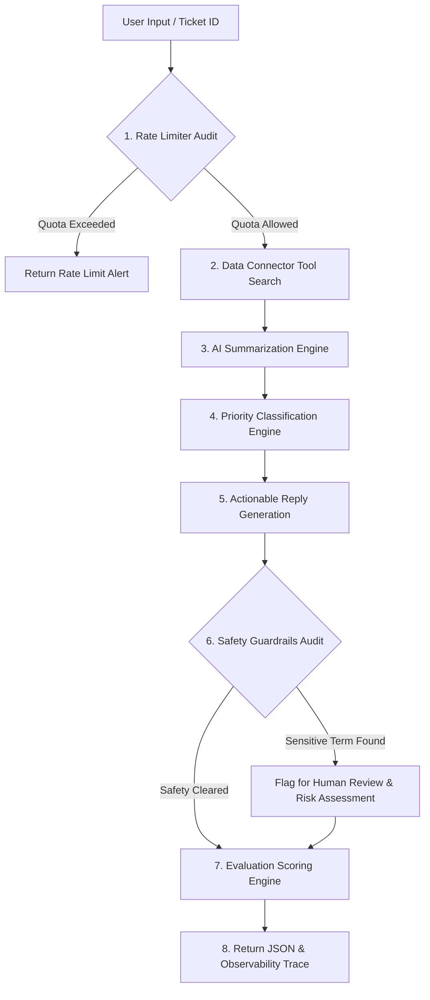

# 🛡️ SentinelAI – Agentic Support Connector with Guardrails & Evaluation Engine

[](https://sentinel-ai-agentic-support-connector-y4rqvjmebpmp4obc827thg.streamlit.app/)
[](https://github.com/Dhanya562004/sentinel-ai-agentic-support-connector)
[](https://python.org)
[](https://modelcontextprotocol.io)
[](LICENSE)

> ⚡ **Live Production App URL:** [https://sentinel-ai-agentic-support-connector-y4rqvjmebpmp4obc827thg.streamlit.app/](https://sentinel-ai-agentic-support-connector-y4rqvjmebpmp4obc827thg.streamlit.app/)

---

> [!IMPORTANT]
> **SentinelAI** is a production-grade enterprise Customer Support Agentic Connector designed to simulate real-world integrations (like **Razorpay Agent Studio**, **Freshdesk**, **Zendesk**, and **Salesforce Service Cloud**) **WITHOUT using external APIs**. It demonstrates agentic orchestration, rule-based NLP reasoning, safety guardrails, quota rate limiting, MCP tool standardization, and automated evaluation metrics.

---

## 🌟 Key Highlights & Live Features

- 🌐 **Live Interactive Web App**: Hosted on Streamlit Cloud with an ultra-sleek dark glassmorphism enterprise dashboard.
- 🤖 **Autonomous Agentic Workflow**: Executes step-by-step query routing, search retrieval, summarization, priority classification, and response synthesis.
- 🧠 **Simulated AI Reasoning**: Performs concise 1-line executive summarization, urgency priority classification, and structured, polite action plan generation.
- 🛡️ **Reliability Guardrails & Safety**: Real-time auditing for high-risk sensitive terms (`fraud`, `payment failed`, `unauthorized`, `hack`), risk-level scoring, and human-in-the-loop escalation triggers.
- 📊 **3-Point Quality Evaluation Engine**: Automated scoring ($X/3$) evaluating summary conciseness, reply completeness/actionability, and priority classification accuracy.
- ⏱️ **Session Rate Limiter**: Enforces a 5-request sliding window session quota with instant reset controls.
- ⚙️ **MCP Standard Compliant**: Standardized tool schemas defined in [`mcp_tools.json`](file:///c:/Users/Deeksha/OneDrive/Desktop/SentinelAI%20%E2%80%93%20Agentic%20Support%20Connector%20with%20Guardrails%20&%20Evaluation%20Engine/mcp_tools.json).

---

## 🏗️ Enterprise System Architecture

SentinelAI follows a modular, production-like decoupled architecture:

```
                                  +-------------------------------------------------------+
                                  |            🌐 Streamlit UI (app.py)                   |
                                  |     Live Web App / Glassmorphism Workbench            |
                                  +---------------------------+---------------------------+
                                                              |
                                                              v
                                  +-------------------------------------------------------+
                                  |          🤖 Agent Orchestrator (agent.py)            |
                                  |              SentinelAgent Pipeline                   |
                                  +-----+-----------------+-----------------+-------------+
                                        |                 |                 |
                       +----------------+                 |                 +----------------+
                       |                                  |                                  |
                       v                                  v                                  v
        +---------------+                +---------------+                +---------------+
        | Rate Limiter  |                | Data Connector|                |   AI Engine   |
        |(rate_limiter.py|                | (connector.py)|                | (ai_engine.py)|
        | Session Quota |                | JSON Search API|                | NLP Reasoning |
        +---------------+                +-------+-------+                +---------------+
                                                 |
                                                 v
                                        +----------------+
                                        |  tickets.json  |
                                        | (15 Support Case|
                                        +----------------+
                                                 |
               +---------------------------------+----------------------------------+
               |                                                                    |
               v                                                                    v
        +---------------+                                                  +---------------+
        |  Guardrails   |                                                  |   Evaluator   |
        |(guardrails.py)|                                                  | (evaluator.py)|
        | Risk & Safety |                                                  | Score (X/3)   |
        +---------------+                                                  +---------------+
```

---

## 🔄 Autonomous Agentic Execution Pipeline

When a user submits a query or selects a ticket ID, the agent orchestrates the following pipeline:



### 📋 JSON Output Schema

```json
{
  "status": "success",
  "session_id": "session_1727850000",
  "total_execution_ms": 42.15,
  "remaining_quota": 4,
  "ticket": {
    "id": "TICK-1001",
    "customer_name": "Rahul Sharma",
    "title": "Payment failed but amount debited from bank account",
    "description": "I tried to pay my monthly invoice of $499 via UPI/Credit Card...",
    "status": "open",
    "priority": "High",
    "category": "Payment Failure"
  },
  "summary": "Issue Summary: Payment transaction failed at checkout.",
  "priority": "High",
  "reply": "Dear Rahul Sharma,\n\nThank you for contacting support...",
  "flagged": true,
  "guardrails": {
    "flagged": true,
    "reasons": ["Detected sensitive keyword(s): payment failed"],
    "requires_human_review": true,
    "risk_level": "CRITICAL"
  },
  "evaluation": {
    "score": 3,
    "max_score": 3,
    "percentage": 100.0,
    "grade": "EXCELLENT"
  }
}
```

---

## 🛡️ Guardrails & Safety Design

SentinelAI incorporates multi-layered safety controls:

1. **Sensitive Keyword Detection**:
   Monitors input/output streams for critical keywords: `["fraud", "payment failed", "unauthorized", "hack", "breach", "security vulnerability", "stolen card", "compromised"]`.
2. **Human-in-the-Loop Escalation**:
   Automatically sets `flagged = True` and displays an explicit **⚠️ Human Review Required Alert Banner** on the live UI.
3. **Empty Output Protection**:
   Supplies a structured fallback response template if generation yields empty or malformed strings.

> [!NOTE]
> **Human Review Alert UI Example:**
> When high-risk keywords like *fraud* or *payment failed* are identified, SentinelAI highlights the risk level (`CRITICAL` / `HIGH`) and notifies operators that automated dispatch is paused pending human verification.

---

## 📊 Evaluation Strategy & Scoring Methodology

Outputs are evaluated against 3 enterprise quality criteria ($X/3$ Score):

| Metric | Pass Condition (+1 Pt) | Evaluation Logic |
| :--- | :--- | :--- |
| **1. Summary Conciseness** | $15 \le \text{length} \le 160$ chars | Verifies summary is a single crisp executive line. |
| **2. Reply Completeness** | Greeting + Action Steps + Signature | Checks presence of formal greeting, numbered action plan, and polite closing. |
| **3. Priority Alignment** | Matches Rule Expectation | Validates assigned priority against keyword urgency rules (`High`, `Medium`, `Low`). |

---

## ⚙️ Model Context Protocol (MCP) Tool Specifications

SentinelAI exposes standardized tool definitions in [`mcp_tools.json`](file:///c:/Users/Deeksha/OneDrive/Desktop/SentinelAI%20%E2%80%93%20Agentic%20Support%20Connector%20with%20Guardrails%20&%20Evaluation%20Engine/mcp_tools.json):

```json
[
  {
    "name": "search_tickets",
    "description": "Searches customer support tickets by title, description, category, or ID",
    "input": "query",
    "output": "list of ticket objects matching query"
  },
  {
    "name": "get_ticket",
    "description": "Retrieves a specific customer support ticket by its exact ticket ID",
    "input": "ticket_id",
    "output": "ticket object containing ticket details"
  },
  {
    "name": "list_tickets",
    "description": "Lists all support tickets with optional status or priority filtering",
    "input": "status, priority",
    "output": "list of all ticket objects"
  },
  {
    "name": "summarize_ticket",
    "description": "Generates a 1-line summary of ticket description using AI reasoning rules",
    "input": "text",
    "output": "1-line executive summary string"
  },
  {
    "name": "classify_priority",
    "description": "Classifies ticket priority into High, Medium, or Low",
    "input": "text",
    "output": "High | Medium | Low priority string"
  },
  {
    "name": "generate_reply",
    "description": "Generates a structured, empathetic customer support response",
    "input": "text, summary, priority, ticket",
    "output": "formatted support reply string"
  },
  {
    "name": "apply_guardrails",
    "description": "Evaluates inputs and outputs for sensitive keywords and safety compliance",
    "input": "query, reply",
    "output": "guardrails assessment object including human review flag"
  },
  {
    "name": "evaluate_response",
    "description": "Scores response quality out of 3 points based on length, completeness, and priority correctness",
    "input": "ticket, summary, priority, reply",
    "output": "evaluation score object (X/3)"
  }
]
```

---

## 🖥️ Interactive Workbench Tabs

The live web application provides 6 specialized tabs:

1. 🤖 **Agent Workbench**: Search tickets, execute agentic workflow, view live execution trace timeline, color-coded priority badges, safety alert banners, and evaluation scorecards.
2. 📋 **Ticket Explorer**: Filter all 15 customer support tickets by status/priority, search keywords, and inspect JSON payloads.
3. 🛡️ **Guardrails & Safety Hub**: Interactive safety sandbox to test text against sensitive keyword triggers and inspect guardrail policies.
4. 📊 **Evaluation Engine**: Global benchmark runner that evaluates all 15 tickets in batch and computes system-wide accuracy statistics.
5. ⚙️ **MCP Tool Inspector**: Live contract viewer for `mcp_tools.json`.
6. 📈 **Observability & Logs**: View live session telemetry, rate-limiting status, and raw JSON payloads.

---

## ⚠️ System Limitations & Future Roadmap

### Current Limitations
- **Rule-Based Reasoning**: Cognitive logic relies on deterministic NLP rules and keyword heuristics rather than live LLM API calls.
- **In-Memory Rate Limiting**: Session quotas are tracked in memory rather than a distributed Redis cache.

### Future Enhancements
- 🧠 **Real LLM Integration**: Connect Google Gemini 1.5/2.0, OpenAI GPT-4o, or Anthropic Claude 3.5.
- 🔍 **Vector Database**: Integrate FAISS or Pinecone for semantic dense vector similarity search.
- 🔐 **OAuth Connectors**: Native webhook connectors for Freshdesk, Zendesk, and Razorpay APIs.
- 🔀 **Multi-Agent Teams**: Framework implementation using LangGraph or AutoGPT for sub-agent task delegation.

---

## 🚀 Local Setup & Installation

```bash
# 1. Clone repository
git clone https://github.com/Dhanya562004/sentinel-ai-agentic-support-connector.git
cd sentinel-ai-agentic-support-connector

# 2. Install dependencies
pip install streamlit pandas numpy

# 3. Run Streamlit app
streamlit run app.py
```

Access the local dashboard at `http://localhost:8501`.

---

<div align="center">
  <sub>Built with ❤️ for Enterprise AI Agentic Systems | SentinelAI Support Connector</sub>
</div>
