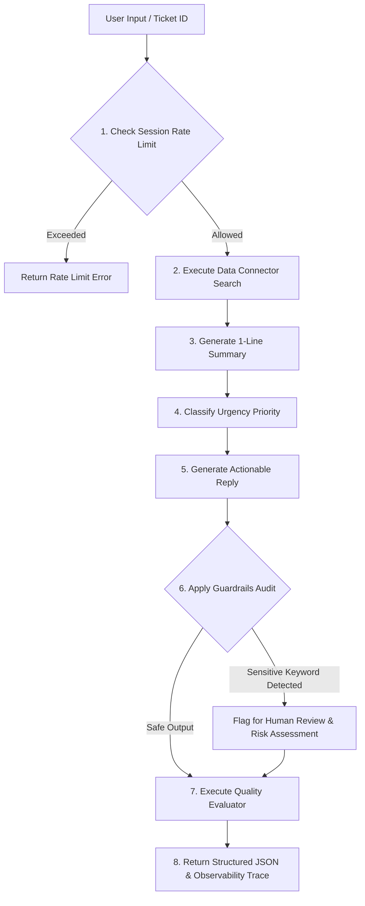

# 🛡️ SentinelAI – Agentic Support Connector with Guardrails & Evaluation Engine

[](https://python.org)
[](https://streamlit.io)
[](https://modelcontextprotocol.io)
[](#architecture)

---

## 📌 1. Project Overview

**SentinelAI** is a production-grade enterprise Customer Support Agentic Connector designed to simulate real-world integrations (e.g., Razorpay Agent Studio, Freshdesk, Zendesk, Salesforce Service Cloud) without requiring external paid APIs. 

The system implements an end-to-end autonomous agent workflow, combining rule-based LLM reasoning simulation, enterprise safety guardrails, rate limiting request controls, Model Context Protocol (MCP) tool standards, and an automated output quality evaluation engine.

### Key Capabilities
- 🤖 **Agentic Workflow Orchestration**: Autonomous step-by-step query routing, ticket retrieval, cognitive reasoning, and response generation.
- 💡 **AI Reasoning Engine (Simulated)**: 1-line executive summarization, urgency priority classification, and structured polite support reply generation.
- 🛡️ **Safety Guardrails & Reliability**: Real-time audit for sensitive keywords (`fraud`, `payment failed`, `unauthorized`, `hack`), risk-level assessment, and human-in-the-loop escalation flagging.
- 📊 **3-Point Evaluation Engine**: Automatic scoring ($X/3$) measuring summary conciseness, reply actionability/completeness, and priority accuracy.
- ⏱️ **Request Rate Limiter**: Sliding-window session quota control enforcing a 5-request limit with instant reset controls.
- ⚙️ **MCP Protocol Compliant**: Standardized tool schemas (`mcp_tools.json`) defining tool input/output contracts.

---

## 🏗️ 2. Enterprise System Architecture

SentinelAI follows a strict modular, production-grade decoupled architecture:

```
                  +-------------------------------------------------------+
                  |                 User Interface (app.py)              |
                  |                Streamlit Web Workbench                |
                  +---------------------------+---------------------------+
                                              |
                                              v
                  +-------------------------------------------------------+
                  |               Agent Core (agent.py)                   |
                  |             SentinelAgent Orchestrator                |
                  +-----+-----------------+-----------------+-------------+
                        |                 |                 |
       +----------------+                 |                 +----------------+
       |                                  |                                  |
       v                                  v                                  v
+---------------+                +---------------+                +---------------+
| Rate Limiter  |                | Data Connector|                |   AI Engine   |
|(rate_limiter.py|                | (connector.py)|                | (ai_engine.py)|
| Session Quota |                | JSON Search API|                | NLP Reasoning |
+---------------+                +-------+-------+                +---------------+
                                         |
                                         v
                                +----------------+
                                |  tickets.json  |
                                | (15 Support Case|
                                +----------------+
                                         |
       +---------------------------------+----------------------------------+
       |                                                                    |
       v                                                                    v
+---------------+                                                  +---------------+
|  Guardrails   |                                                  |   Evaluator   |
|(guardrails.py)|                                                  | (evaluator.py)|
| Risk & Safety |                                                  | Score (X/3)   |
+---------------+                                                  +---------------+
```

### Module Matrix

| Module | Responsibility | Output / Artifact |
| :--- | :--- | :--- |
| [`connector.py`](file:///c:/Users/Deeksha/OneDrive/Desktop/SentinelAI%20%E2%80%93%20Agentic%20Support%20Connector%20with%20Guardrails%20&%20Evaluation%20Engine/connector.py) | Data Access Layer & Simulated API | Ticket JSON payloads, search ranking |
| [`ai_engine.py`](file:///c:/Users/Deeksha/OneDrive/Desktop/SentinelAI%20%E2%80%93%20Agentic%20Support%20Connector%20with%20Guardrails%20&%20Evaluation%20Engine/ai_engine.py) | Simulated LLM Cognitive Engine | Summaries, Priorities, Replies |
| [`guardrails.py`](file:///c:/Users/Deeksha/OneDrive/Desktop/SentinelAI%20%E2%80%93%20Agentic%20Support%20Connector%20with%20Guardrails%20&%20Evaluation%20Engine/guardrails.py) | Safety Audit & Risk Layer | Human review flags, safe fallback text |
| [`rate_limiter.py`](file:///c:/Users/Deeksha/OneDrive/Desktop/SentinelAI%20%E2%80%93%20Agentic%20Support%20Connector%20with%20Guardrails%20&%20Evaluation%20Engine/rate_limiter.py) | Session Request Control | Session request quota enforcement |
| [`evaluator.py`](file:///c:/Users/Deeksha/OneDrive/Desktop/SentinelAI%20%E2%80%93%20Agentic%20Support%20Connector%20with%20Guardrails%20&%20Evaluation%20Engine/evaluator.py) | Output Quality Scoring | Score object ($X/3$) & metric breakdown |
| [`agent.py`](file:///c:/Users/Deeksha/OneDrive/Desktop/SentinelAI%20%E2%80%93%20Agentic%20Support%20Connector%20with%20Guardrails%20&%20Evaluation%20Engine/agent.py) | End-to-end Pipeline Orchestrator | Structured output & observability trace |
| [`app.py`](file:///c:/Users/Deeksha/OneDrive/Desktop/SentinelAI%20%E2%80%93%20Agentic%20Support%20Connector%20with%20Guardrails%20&%20Evaluation%20Engine/app.py) | Streamlit Enterprise Dashboard | Glassmorphism Interactive UI |

---

## 🔄 3. Agentic Workflow Execution Pipeline

When a user enters a query or ticket ID into SentinelAI, the orchestrator executes an 8-stage synchronous workflow:



### JSON Output Schema

```json
{
  "status": "success",
  "session_id": "session_1727850000",
  "remaining_quota": 4,
  "ticket": {
    "id": "TICK-1001",
    "customer_name": "Rahul Sharma",
    "title": "Payment failed but amount debited from bank account",
    "description": "...",
    "status": "open",
    "priority": "High"
  },
  "summary": "Issue Summary: Payment transaction failed at checkout.",
  "priority": "High",
  "reply": "Dear Rahul Sharma,\n\nThank you for contacting support...",
  "flagged": true,
  "guardrails": {
    "flagged": true,
    "reasons": ["Detected sensitive keyword(s): payment failed"],
    "requires_human_review": true,
    "risk_level": "CRITICAL"
  },
  "evaluation": {
    "score": 3,
    "max_score": 3,
    "percentage": 100.0,
    "grade": "EXCELLENT"
  }
}
```

---

## 🛡️ 4. Guardrails & Safety Engineering

SentinelAI incorporates defense-in-depth reliability patterns to ensure safety and risk mitigation:

1. **Sensitive Keyword Detection**:
   Audits text against high-risk domain terms: `["fraud", "payment failed", "unauthorized", "hack", "breach", "security vulnerability", "stolen card", "compromised"]`.
2. **Human-in-the-Loop Escalation**:
   When sensitive keywords or critical risk factors are triggered, the output is flagged with `requires_human_review = True`, rendering a prominent **⚠️ Human Review Required Alert Banner** on the UI.
3. **Empty Output & Malformed Input Fallback**:
   Guarantees that empty LLM outputs or corrupted responses automatically resolve to a safe, polite fallback response template rather than failing silently.

---

## 📊 5. Evaluation Strategy & Observability Engine

Output quality is automatically evaluated on a 3-point benchmark ($X/3$):

- **Metric 1: Summary Conciseness (+1)**
  Validates that the generated summary is a single concise line between 15 and 160 characters.
- **Metric 2: Reply Completeness & Actionability (+1)**
  Verifies that the reply contains a formal greeting, numbered action steps, and a professional closing signature.
- **Metric 3: Priority Classification Accuracy (+1)**
  Cross-checks classified priority against rule-based expectations derived from ticket urgency keywords.

---

## ⚡ 6. Model Context Protocol (MCP) Tool Specifications

SentinelAI exposes standardized tool specifications in [`mcp_tools.json`](file:///c:/Users/Deeksha/OneDrive/Desktop/SentinelAI%20%E2%80%93%20Agentic%20Support%20Connector%20with%20Guardrails%20&%20Evaluation%20Engine/mcp_tools.json) following the Model Context Protocol standard:

```json
[
  {
    "name": "search_tickets",
    "description": "Searches customer support tickets by title, description, category, or ID",
    "input": "query",
    "output": "list of ticket objects matching query"
  },
  {
    "name": "get_ticket",
    "description": "Retrieves a specific customer support ticket by its exact ticket ID",
    "input": "ticket_id",
    "output": "ticket object containing ticket details"
  }
]
```

---

## ⚠️ 7. System Limitations

- **Rule-based LLM Simulation**: The current reasoning engine utilizes deterministic NLP heuristics and keyword matching rather than neural model weights (OpenAI / Anthropic).
- **In-Memory Rate Limiter**: Rate limiting is tracked per-session using in-memory Python structures rather than a distributed Redis cache.

---

## 🚀 8. Future Roadmap & Enhancements

- 🧠 **Real LLM Integration**: Connect native APIs (Google Gemini 1.5/2.0, OpenAI GPT-4o, Anthropic Claude 3.5).
- 🔍 **Vector DB Integration**: Implement FAISS or Pinecone for semantic dense vector embeddings search.
- 🔐 **OAuth Enterprise Connectors**: Direct live webhooks for Freshdesk, Zendesk, and Razorpay APIs.
- 🔀 **Multi-Agent Orchestration**: Expand workflow using LangGraph or AutoGPT for sub-agent delegation.

---

## 💻 9. How to Run Locally

### Prerequisites
- Python 3.10+
- Streamlit

### Quickstart

1. **Clone Repository**:
   ```bash
   git clone https://github.com/Dhanya562004/sentinel-ai-agentic-support-connector.git
   cd "sentinel-ai-agentic-support-connector"
   ```

2. **Install Dependencies**:
   ```bash
   pip install streamlit pandas numpy
   ```

3. **Launch Streamlit Dashboard**:
   ```bash
   streamlit run app.py
   ```

4. Open browser at `http://localhost:8501`.

---

© 2026 SentinelAI Engineering Team. Enterprise Agentic Support Connector.
